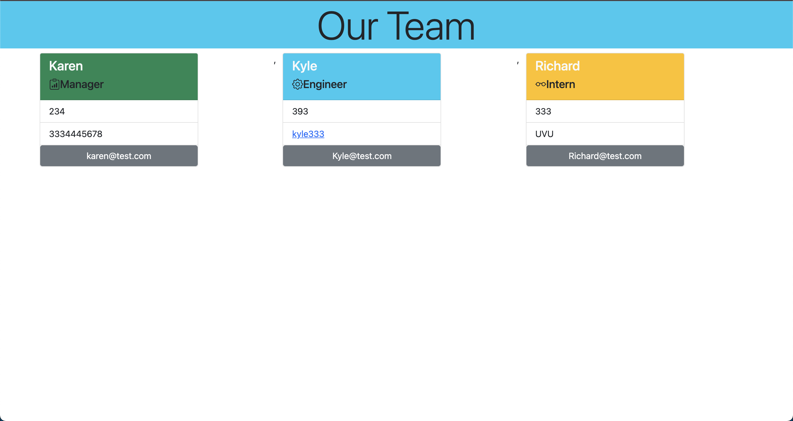

# Challenge 11 Team-Profile-Generator
> Lets back the backend of a social media website!
---
### Table of Contents
- [Description](#description)
- [Introduction](#introduction)
- [Mockup](#mockup)
- [Challenges](#challenges)
- [Victories](#victories)
- [Technologies Used](#technologies)
- [Resources](#resources)

---

## Description

Node.js command-line application that takes in information about employees on a software engineering team and generates an HTML webpage that displays summaries for each person. Because testing is key to making code maintainable, you’ll also write unit tests for each part of your code and ensure that it passes all of them.

## Introduction 
GIVEN a command-line application that accepts user input
WHEN I am prompted for my team members and their information
THEN an HTML file is generated that displays a nicely formatted team roster based on user input
WHEN I click on an email address in the HTML
THEN my default email program opens and populates the TO field of the email with the address
WHEN I click on the GitHub username
THEN that GitHub profile opens in a new tab
WHEN I start the application
THEN I am prompted to enter the team manager’s name, employee ID, email address, and office number
WHEN I enter the team manager’s name, employee ID, email address, and office number
THEN I am presented with a menu with the option to add an engineer or an intern or to finish building my team
WHEN I select the engineer option
THEN I am prompted to enter the engineer’s name, ID, email, and GitHub username, and I am taken back to the menu
WHEN I select the intern option
THEN I am prompted to enter the intern’s name, ID, email, and school, and I am taken back to the menu
WHEN I decide to finish building my team
THEN I exit the application, and the HTML is generated

---
## Mockup

---
## Challenges

The overall project was ok but getting all the javascript set up correctly and the connections all set-up.

---
## Victories

Was able to get the styling the way I wanted it. 

---

## Technologies

- NoSQL Database 
- Mongoose
- Express.js
- Node.js

---

## Resources 

<a href="https://github.com/Jberg21/Team-Profile-Generator">GitHub Repo</a>

<a href="https://youtu.be/n6pM2KpbtgI">YouTube</a>

---